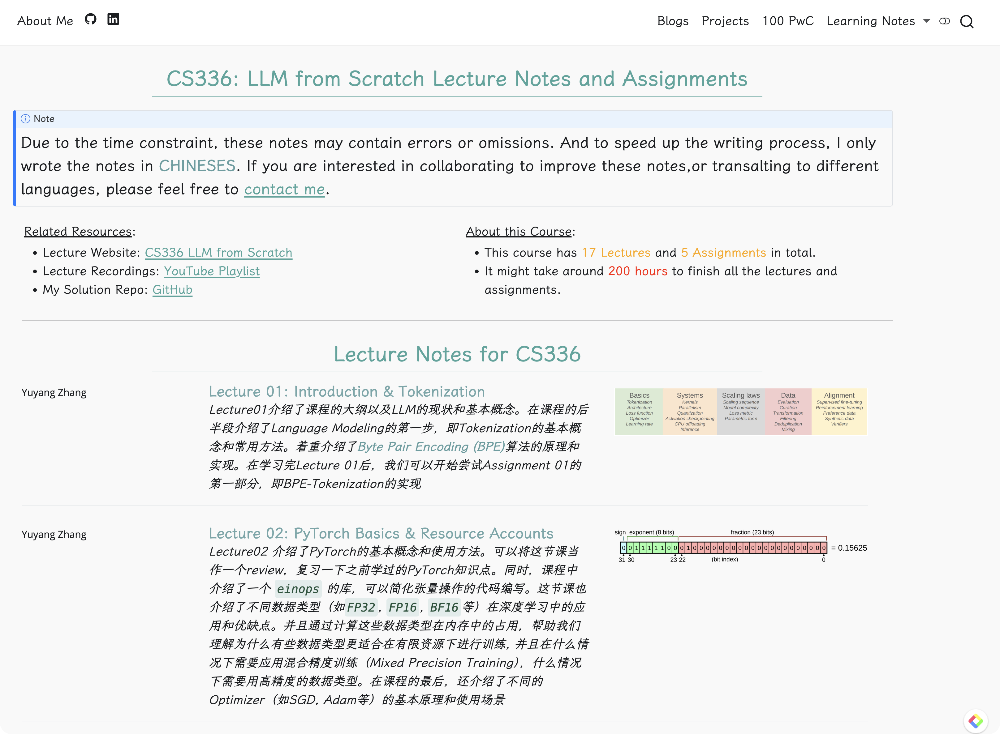
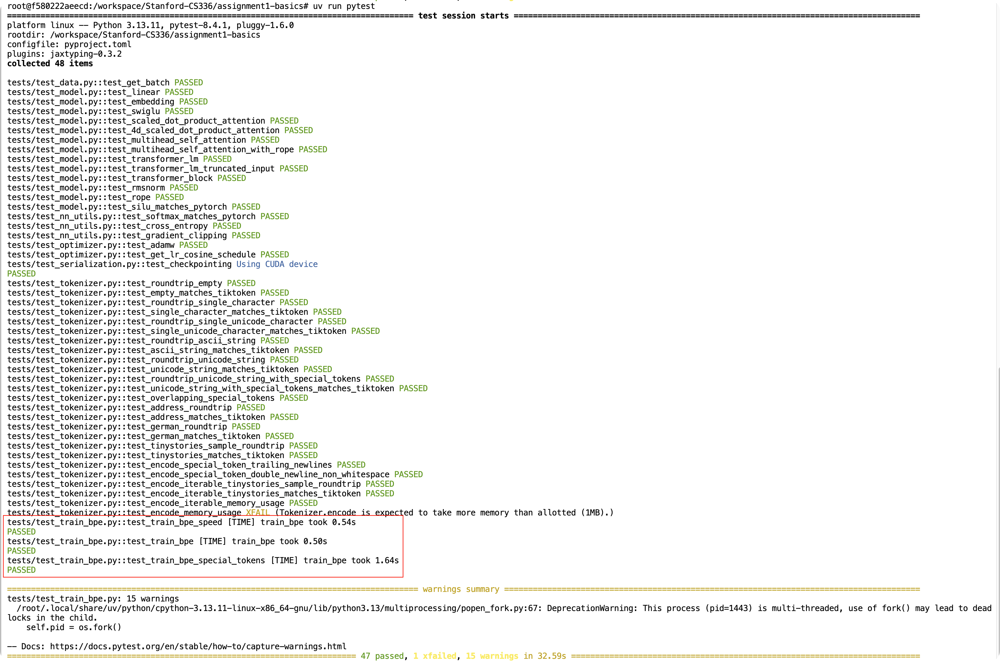
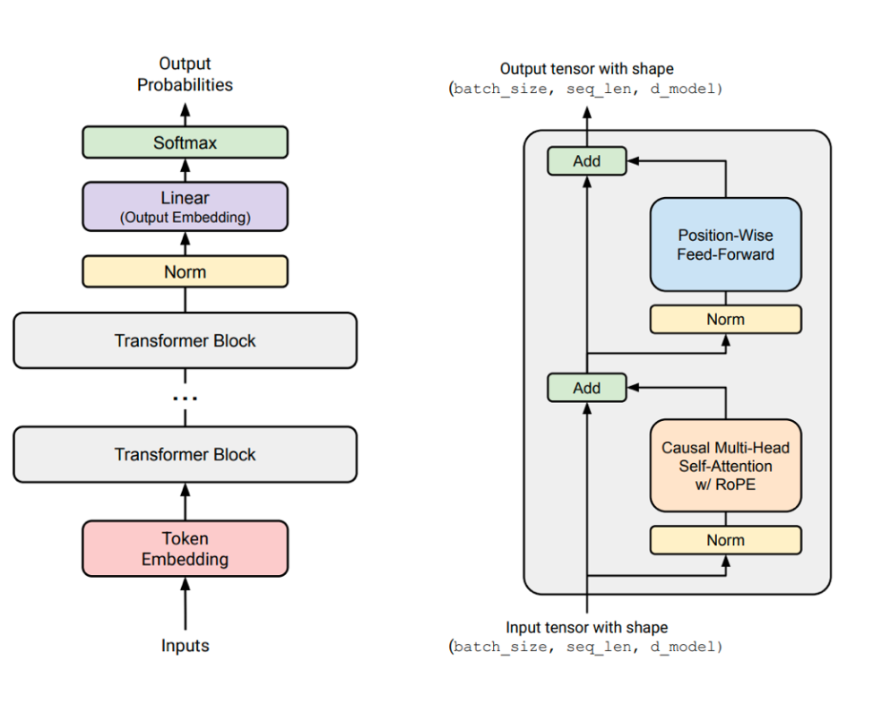
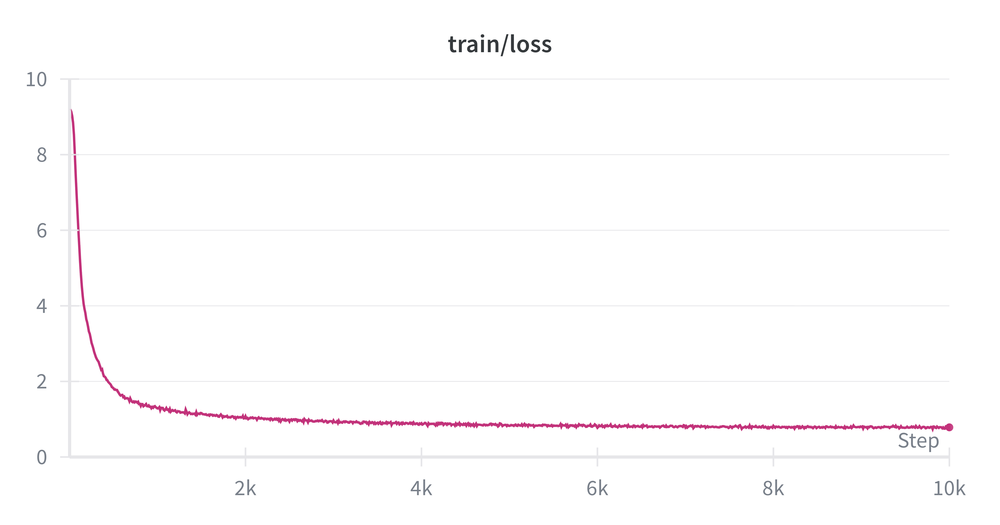
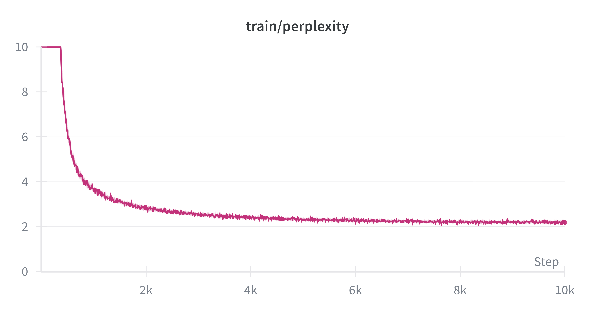
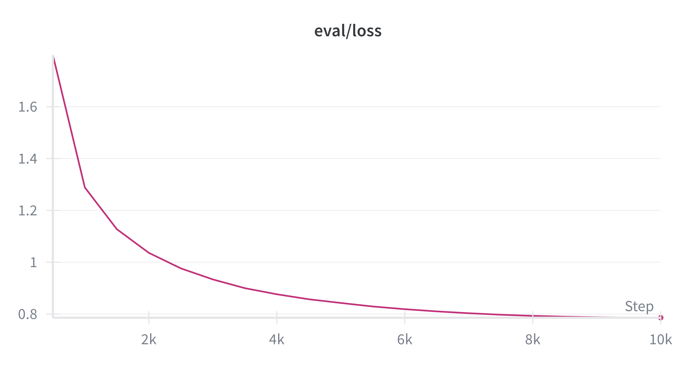
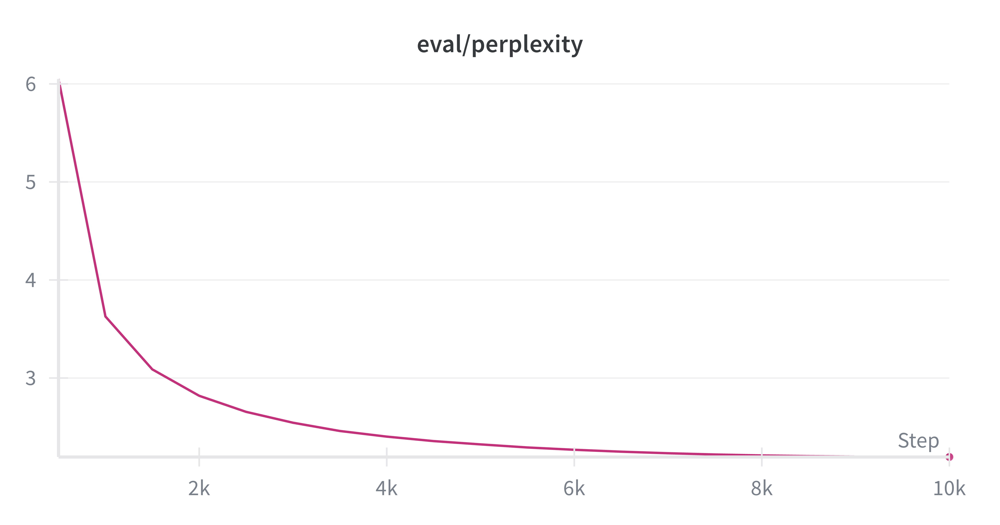
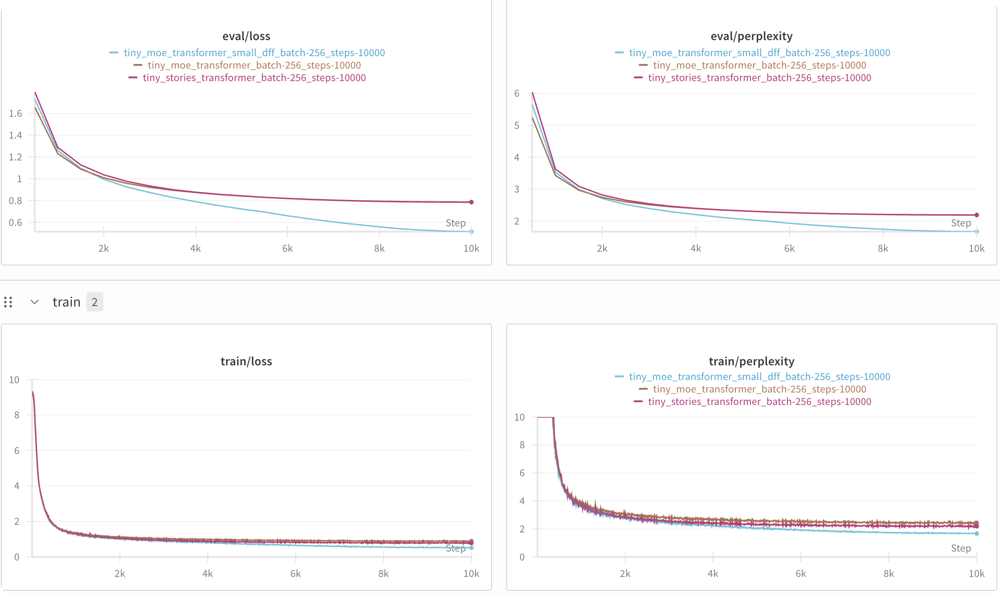

<h1 align="center">My SOLUTION to <br/>
CS336: Language Modeling from Scratch <br/>
(Spring 2025 Version)</h1>


- [Assignment 01: Tokenization \& Language Modeling](#assignment-01-tokenization--language-modeling)
  - [Part 0: Environment Setup \& Data Download](#part-0-environment-setup--data-download)
  - [Part 1: BPE Tokenizer](#part-1-bpe-tokenizer)
  - [Part 2: Language Model \& Optimizer](#part-2-language-model--optimizer)
  - [Part 3: Training Model](#part-3-training-model)
    - [Configuration](#configuration)
    - [Learning Curves](#learning-curves)
    - [Genrated Sample](#genrated-sample)
  - [Bonus: MoE Layer](#bonus-moe-layer)
- [Assignment 02: Flash Attention \& Parallelism](#assignment-02-flash-attention--parallelism)
- [Assignment 03: Scaling Laws](#assignment-03-scaling-laws)
- [Assignment 04: Data](#assignment-04-data)
- [Assignment 05: Alignment \& RLHF (GRPO)](#assignment-05-alignment--rlhf-grpo)


This repository contains my notes and solutions for the [Stanford CS336: Language Modeling from Scratch](https://stanford-cs336.github.io/spring2025). I also created a website containing more details of the lectures. If you are interested, please go to visited this [website](https://yyzhang2025.github.io/posts/LearningNotes/CS336)


[](https://yyzhang2025.github.io/posts/LearningNotes/CS336/)


> [!note]
>
> This is the NEW version of my solution, for those who have see my solutions before, here is the [OLD version](https://github.com/YYZhang2025/Stanford-CS336/tree/old-main), if you are interested. 

# Assignment 01: Tokenization & Language Modeling



## Part 0: Environment Setup & Data Download
We first need install the virtual environment manager `uv` to ensure reproducibility, portability, and ease of use.

```sh
pip install uv
# or
brew install uv
```

After installing `uv`, we can run any code in the repo using
```sh
uv run <python_file_path>
```
and the environment will be automatically solved and activated when necessary. 

Or create and activate the environment manually using:
```sh
uv sync
source .venv/bin/activate
```

It will install all the dependencies specified in `pyproject.toml`.

Than we can download the TinyStories data and a subsample of OpenWebText

``` sh
mkdir -p data
cd data

wget https://huggingface.co/datasets/roneneldan/TinyStories/resolve/main/TinyStoriesV2-GPT4-train.txt
wget https://huggingface.co/datasets/roneneldan/TinyStories/resolve/main/TinyStoriesV2-GPT4-valid.txt

wget https://huggingface.co/datasets/stanford-cs336/owt-sample/resolve/main/owt_train.txt.gz
gunzip owt_train.txt.gz
wget https://huggingface.co/datasets/stanford-cs336/owt-sample/resolve/main/owt_valid.txt.gz
gunzip owt_valid.txt.gz

cd ..
```

It will create a `data` folder in the current directory and download the required datasets into it.

## Part 1: BPE Tokenizer 


With my implementation, it took about 1 min to train the BPE Tokenizer for Tinystories

```bash
Identified 10 chunks for pre-tokenization.
Pre-tokenization processes completed. Aggregating results...
Completed pre-tokenization. Vocabulary size: 59933 unique tokens.
100%|████████████████████████████████████████████████████████████████████████| 9743/9743 [00:53<00:00, 181.61it/s]
[TIME] train_bpe took 85.40s
```


And token **30mins** to pre-tokenize the whole file and save as `.bin`. 

> [!note]
>
> For those who want to re-produce my results or just want to focus on the model training, I highly recommend to download my version of tokenization, you can download it through following commend:
>
> ```bash
> pip install -U huggingface_hub
> hf download YuYangZhang/TinyStory-Tokenized  --repo-type dataset --local-dir datasets/tiny_stories
> ```
>
> It will download the `merges.txt`, `vocab.json`, `special_tokens.txt`,`train.bin`, `eval.bin` to local-directory. 


## Part 2: Language Model & Optimizer

The Language Model is as following:



Here is the model configuration:

```Python
@dataclass
class ModelConfig:
    vocab_size: int = 10000
    max_seq_len: int = 256

    d_model: int = 512
    d_ff: int = 1344

    num_heads: int = 16
    num_layers: int = 4

    dropout: float = 0.1

    use_rms_norm: bool = True
    pre_norm: bool = True

    # Special token IDs
    eos_token_id: int = 256

    # RoPE
    use_rope: bool = True
    rope_theta: float = 10000.0
```


## Part 3: Training Model 


### Configuration 

The train config for my model is following:

```Python
@dataclass
class TrainingConfig:
    batch_size: int = 256
    num_steps: int = 10_000
    dataset_dir: str = "datasets/tiny_stories"
    train_data_path: str = "datasets/tiny_stories/train.bin"
    eval_data_path: str = "datasets/tiny_stories/eval.bin"

    # Optimizer related parameters
    betas: tuple = field(default=(0.9, 0.98))
    weight_decay: float = 1e-5
    max_lr: float = 3e-4
    min_lr: float = 1e-5
    warmup_steps: int = 500
    max_grad_norm: float = 1.0

    # Logging & checkpointing
    wandb_logging: bool = True
    eval_log_interval: int = 500
    sampling_log_interval: int = 200

    # Others:
    model_name: str = "tiny_stories_transformer"
    save_checkpoint_dir: str = "checkpoints"
    device: str = "cpu"
    debug_mode: bool = False
    use_mixed_precision: bool = True
    seed: int = 2025
```


Under this `TrainingConfig` and `ModelConfig`, it took me **34m28s** to finish the training on 1 $\times$ H100 GPU.  


### Learning Curves











### Genrated Sample

```Text
  Once upon a time, there was a little girl named Lucy. She was very excited because she had a fancy dress with pink ribbons in it. Her mom gave her a big bag of rice to show her how to use it.
One day, Lucy wanted to help her mom make the best picture. She took a big bag and started to make a pretty picture. It was a modest person who loved peanuts and games. Lucy was very
happy with her picture.
But then, something unexpected happened. The peanuts started to grow and grow into a big, beautiful picture on the wall. Lucy was surprised to see a hat and thought it was her fancy 
pice said. She happy to hug her now was a little between it could the she the the she the day and the the show his the the Max up time the the to the with the ball the the to the the
a her she find a the They fess and lots twins was a fold said, I fold the a the he to the two dry find the to the pers they loved moved they her the Lily wraced 
```


## Bonus: MoE Layer

In the [Lecture 04](https://www.youtube.com/watch?v=LPv1KfUXLCo&list=PLoROMvodv4rOY23Y0BoGoBGgQ1zmU_MT_&index=4), we have learned about Mixture of Experts (MoE) layer to increase the model capacity without significantly increasing the computation cost. However, in the first assignment, we did not implement the MoE layer in the model. Here is my implementation of the MoE layer using Top-k Gating mechanism, with z-loss and load balancing loss to stabilize the training.


I have implement the MoE layer in  `assignment1-basics/cs336_basics/modules/moe.py` file. And the training code in the `assignment1-basics/train_moe.py` file.  I trained 2 version of the MoE model:

- 4-expert MoE model with same `d_ff` as the dense model `tiny_moe_transformer_batch-256_steps-10000`
- 4-expert MoE model with $\frac{d_{ff}}{4}=336$ as the dense model, name as `
tiny_moe_transformer_small_dff_batch-256_steps-10000`


Below are the learning curves for both MoE models compared with the dense model.



As we can see, the MoE model with smaller `d_ff` outperforms the dense model with same computation cost, demonstrating the effectiveness of MoE layers in increasing model capacity. However, the MoE model with same `d_ff` as dense model does not show significant improvement, possibly due to the increased model size leading to over-fitting on the small TinyStories dataset.


# Assignment 02: Flash Attention & Parallelism

```Python
raise NotImplementedError("This is a placeholder for Assignment 02 solution.")
```


# Assignment 03: Scaling Laws 
```Python
raise NotImplementedError("This is a placeholder for Assignment 03 solution.")
```


# Assignment 04: Data 
```Python
raise NotImplementedError("This is a placeholder for Assignment 04 solution.")
```

# Assignment 05: Alignment & RLHF (GRPO)
```Python
raise NotImplementedError("This is a placeholder for Assignment 05 solution.")
```
