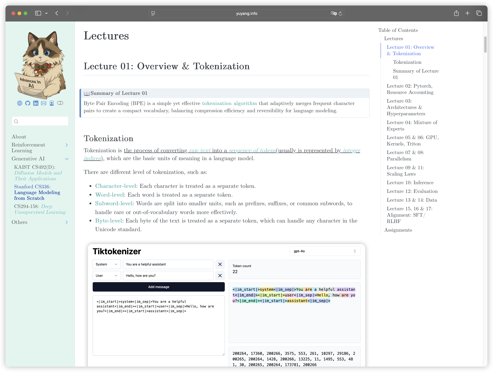
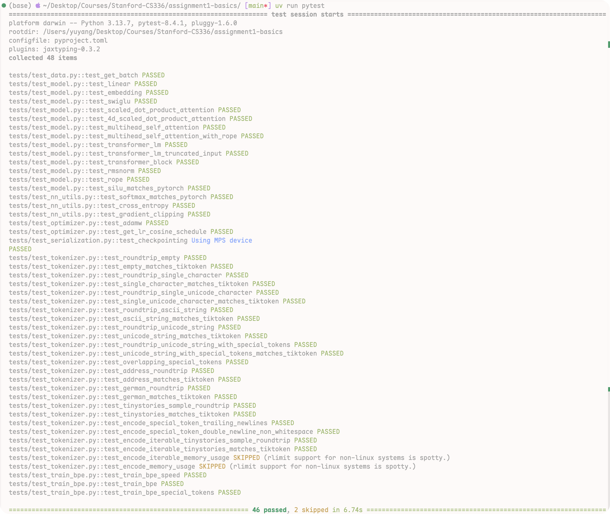

## About this Repository

This repository contains my solutions for the [Stanford CS336: LLM from scratch(2025 Version)](https://stanford-cs336.github.io/spring2025/index.html#schedule). 

My Notes are available in the [Notes](https://yuyang.info/Course-Notes/posts/Gen-AI/stanford-cs336.html)


[](https://yuyang.info/Course-Notes/posts/Gen-AI/stanford-cs336.html)


(If you find any mistakes, please feel free to open an issue or submit a pull request. I will be happy to fix it.)

## Assignment 01: Basics
(Time assumed: 10 hours)



---

In the assignment 1, it will ask you to implement the:

- BPE Tokenizer 
- Rope Positional Encoding
- Multi-head Attention

And so on, for me, the most challenging and error-prone part is the BPE Tokenizer.  After that, the rest of the code is relatively straightforward. If you want to learn about Transformer, I highly recommend through my this post [PwC-01: Transformer](https://yuyang.info/100-AI-Papers/posts/01-transformer.html)(Due to the limited time, I only wrote the Chinese version, but code part is available).


### Assignment 02: System
```Python
raise NotImplementedError("This assignment is not implemented yet.")
```


### Assignment 03: Scaling 
```Python
raise NotImplementedError("This assignment is not implemented yet.")
```


### Assignment 04: Data 
```Python
raise NotImplementedError("This assignment is not implemented yet.")
```

### Assignment 05: Alignment and Reasoning RL 
```Python
raise NotImplementedError("This assignment is not implemented yet.")
```