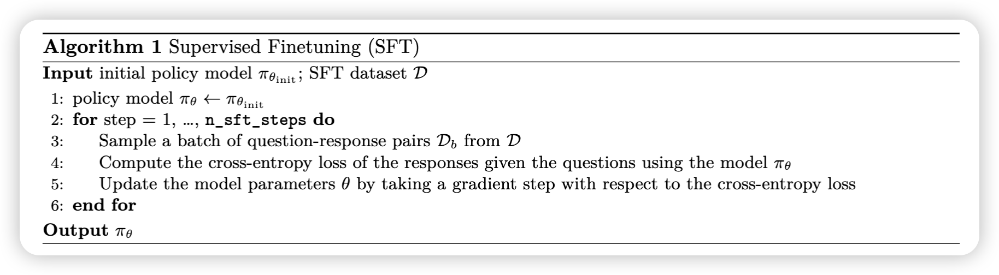
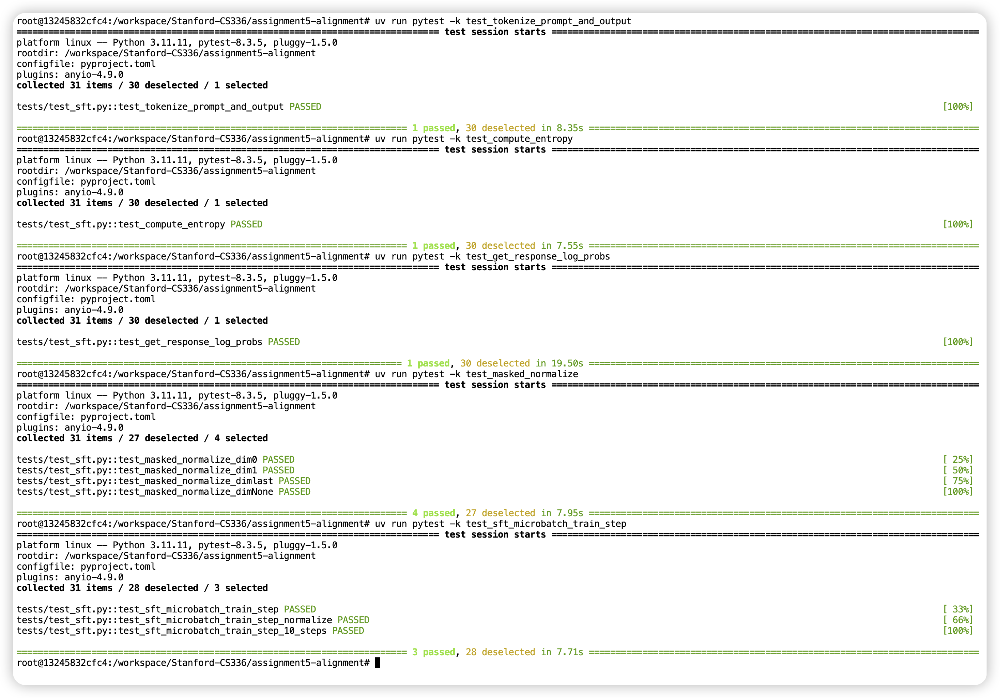
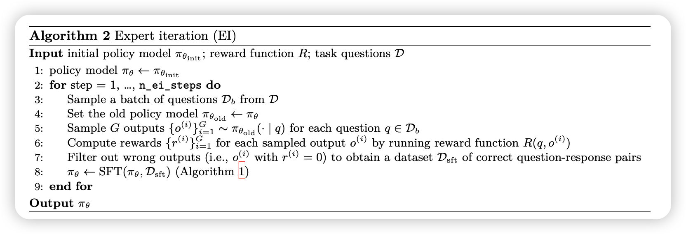
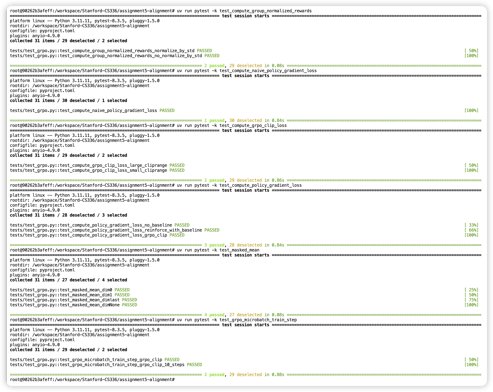

## About this Repository

This repository contains my solutions for the [Stanford CS336: LLM from scratch(2025 Version)](https://stanford-cs336.github.io/spring2025/index.html#schedule). 

My Notes are available in the [Notes](https://yuyang.info/Course-Notes/posts/Gen-AI/stanford-cs336.html)


[](https://yuyang.info/Course-Notes/posts/Gen-AI/stanford-cs336.html)


(If you find any mistakes, please feel free to open an issue or submit a pull request. I will be happy to fix it.)

>[!note]
> The **time assumed** for each assignment is for implement code and pass all the test, for training model, the time might vary according different hyper-parameters, dataset, and hardware


## Assignment 01: Basics
(Time assumed: **10 hours**)


---

In the assignment 1, it will ask you to implement the:

- BPE Tokenizer 
- Rope Positional Encoding
- Multi-head Attention

And so on, for me, the most challenging and error-prone part is the BPE Tokenizer.  After that, the rest of the code is relatively straightforward. If you want to learn about Transformer, I highly recommend through my this post [PwC-01: Transformer](https://yuyang.info/100-AI-Papers/posts/01-transformer.html)(Due to the limited time, I only wrote the Chinese version, but code part is available).


### Assignment 02: System
```Python
raise NotImplementedError("This assignment is not implemented yet.")
```


### Assignment 03: Scaling 
```Python
raise NotImplementedError("This assignment is not implemented yet.")
```


### Assignment 04: Data 
```Python
raise NotImplementedError("This assignment is not implemented yet.")
```

### Assignment 05: Alignment and Reasoning RL 
(Time assumed: **5 hours**) for detailed instructions to implement the code, please check my this [note](https://yuyang.info/Course-Notes/posts/Gen-AI/stanford-cs336.html).

GPUs: 2 ✖️ [L40 GPUs](https://images.nvidia.com/content/Solutions/data-center/vgpu-L40-datasheet.pdf), has 40GB RAM each.

---

Setup the environment
```Shell
uv sync --no-install-package flash-attn
uv sync
source .venv/bin/activate
```

Create `.env` to specify environment variables.

```Text
WANDB_API_KEY=
WANDB_ENTITY=
WANDB_PROJECT=
```

Since we are not using the compute resource mentioned in the Course, we need download model weight and tokenizer to pass the text case

```Shell
uv add huggingface_hub
uv run python download_model.py \
  --repo-id Qwen/Qwen2.5-Math-1.5B \
  --save-dir /data/a5-alignment/models/Qwen2.5-Math-1.5B \
  --method snapshot --no-symlinks --verify
```

#### 3 Measuring Zero-Shot MATH Performance 
We can evaluate the model perform by running the following code:

```Shell
chmod +x ./scripts/eval.sh
./scripts/eval.sh
```
By change the `MODEL_NAME` in the `eval.sh`, we can evaluate different models.


#### 4 Supervised Finetuning for MATH


We need to define several helper function to help us to run SFT and RLHF algorithms:
1. `tokenize_prompt_and_output`: Take in the prompt and output text, and return the tokenized input and output, and response mask which is 0 for prompts and padding tokens, 1 for output tokens.
2. `compute_entropy`: Compute the entropy of the each output tokens.
3. `get_response_log_probs`: Take in the model, input_ids(which has been tokenized), and labels, and return the log probabilities of the output tokens. 
4. `masked_normalize`: Normalize the logits of the output tokens, masking the padding tokens.
5. `sft_microbatch_train_step`: Perform a single training step for SFT with micro-batching.

After pass all the text, we can define SFT training loop, the core part is as follows:
```Python
while True:
    for i, data in enumerate(dataloader):
		input_ids = data["input_ids"].to(train_config.train_device)
		labels = data["labels"].to(train_config.train_device)
		response_mask = data["response_mask"].to(train_config.train_device)

		with ctx:
			log_prob = get_response_log_probs(model=model, input_ids=input_ids, labels=labels)
			log_prob = log_prob["log_probs"]
			loss, _ = sft_microbatch_train_step(
				log_prob, response_mask, train_config.gradient_accumulation_steps
			)
		if total_micro_steps % train_config.gradient_accumulation_steps == 0:
			optimizer.step()
            optimizer.zero_grad()
```



We can train the model by running:
```Shell
python train_sft.py
```

After we trained the model, we can evaluate by change the `MODEL_NAME` in the `eval.sh`, and then run the script.

```Shell
./scripts/eval.sh
```

#### 5 Expert Iteration for Math


Since we have define several helper functions, we can now implement the expert iteration algorithm for math.
The core part of the EI algorithm is as following:
```Python
for step in range(train_config.n_ei_steps):
    # (3) Sample a batch of questions Db from D
    batch = next(cycled_dataloader)
    question_batch = batch[0]  # Convert to list
    answer_batch = batch[2]  # Convert to list

    # (5-6-7) Sample G outputs per question, compute rewards, filter to correct pairs
    kept_prompts, kept_outputs = ei_collect_correct_pairs(
        vllm_model=vllm,
        reward_fn=r1_zero_reward_fn,
        prompts=question_batch,
        answers=answer_batch,
        train_config=train_config,
    )

     # (8) pi_theta <- SFT(pi_theta, D_sft)
     train_sft_model(
        model=model,
        tokenizer=tokenizer,
        optimizer=optimizer,
        train_config=train_config,
        train_prompts=kept_prompts,
        train_cot=kept_outputs,
        train_answers=[0] * len(kept_prompts),  # Dummy answers, not used in SFT
        global_step=global_step,
        ei_steps=step,
        pairs_this_ei=len(kept_prompts),
    )
```

Then, run the code with:
```Shell
python train_ei.py
```


#### 7 GRPO

We need to define several helper functions to help us implement the GRPO algorithm:
1. `compute_group_normalized_rewards`: Compute the normalized rewards(a.k.a advantages) for a group of samples.
2. `compute_naive_policy_gradient_loss`: Compute the naive policy gradient loss for a group of samples.
3. `compute_grpo_clip_loss`: Compute the GRPO clipped loss for a group of samples.
4. `compute_policy_gradient_loss`: Allow us to compute different loss functions using the same framework.
5. `masked_mean`: Compute the mean of the tensor, masking the padding tokens.
6. `grpo_microbatch_train_step`: Perform a single training step for GRPO with micro-batching.




After we define the helper functions, we can define the training loop, the core part is as below
```Python
def train_grpo(
    train_config: TrainConfig,
    eval_config: EvaluateConfig,
    train_prompts,
    train_cot,
    train_answers,
    vllm: LLM,
):

	# Initalize the model, tokenizer, and optimizer
	model = ...
	tokenizer = ...
	optimizer = ... 
		
	# intialize the dataset used for sample question from the total data
	base_ds = ...
	base_dl =...
	# (2): for step = 1, …, n_grpo_steps do
	for grpo_step in range(n_grpo_steps):
		# (3): Sample batch 
		batch = next(base_dl)
		
		# (4): Set old policy 
		load_model_into_vllm_instance(model, vllm)
		
		# (5): Sample G outputs per question
		all_gens = vllm.generate(sample_prompts, grpo_sp)
		all_prompts = []
        all_responses = []
        all_answers = []
        for q, a, gens in zip(sample_prompts, sample_answers, all_gens):
            for i, o in enumerate(gens.outputs):
                all_prompts.append(q)
                all_responses.append(o.text)
                all_answers.append(a)
            
        # (6) / (7): Compute rewards for each sampled output
        advantages_train, raw_rewards_train, metadata = compute_group_normalized_rewards(
            r1_zero_reward_fn,
            rollout_responses=all_responses,
            repeated_ground_truths=all_answers,
            group_size=train_config.group_size,
            advantage_eps=train_config.advantage_eps,
            normalized_by_std=train_config.use_std_normalization,
        )
        
        # (8) / (9): Update Policy
        update_policy(
            model=model,
            optimizer=optimizer,
            train_config=train_config,
            prompts=all_prompts,
            responses=all_responses,
            raw_rewards=raw_rewards_train,
            advantages=advantages_train,
            tokenizer=tokenizer,
            global_step=global_step,
        )
```
We can start training our model using:

```Python
python train_grpo.py
```


